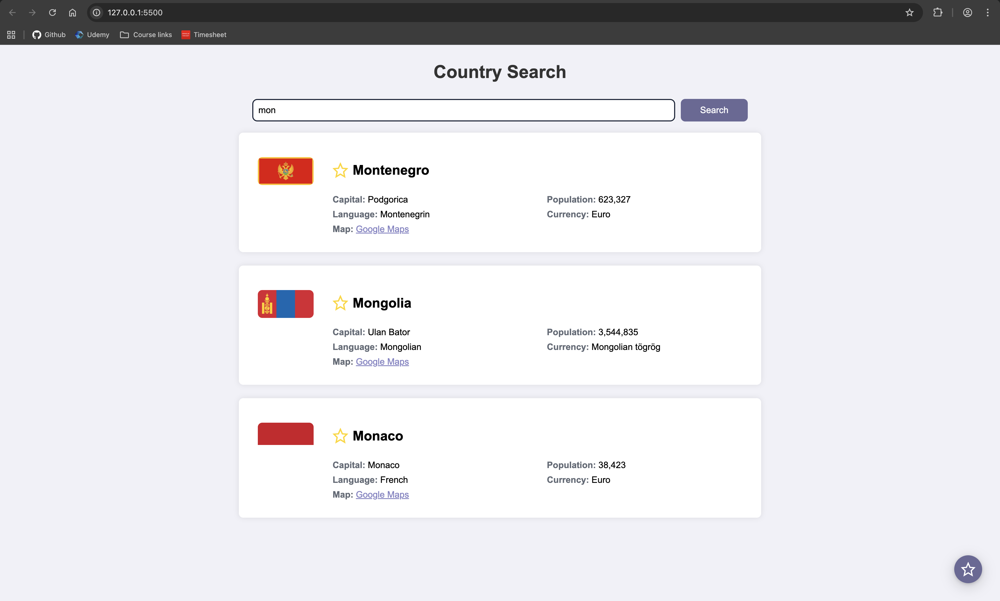
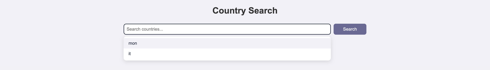
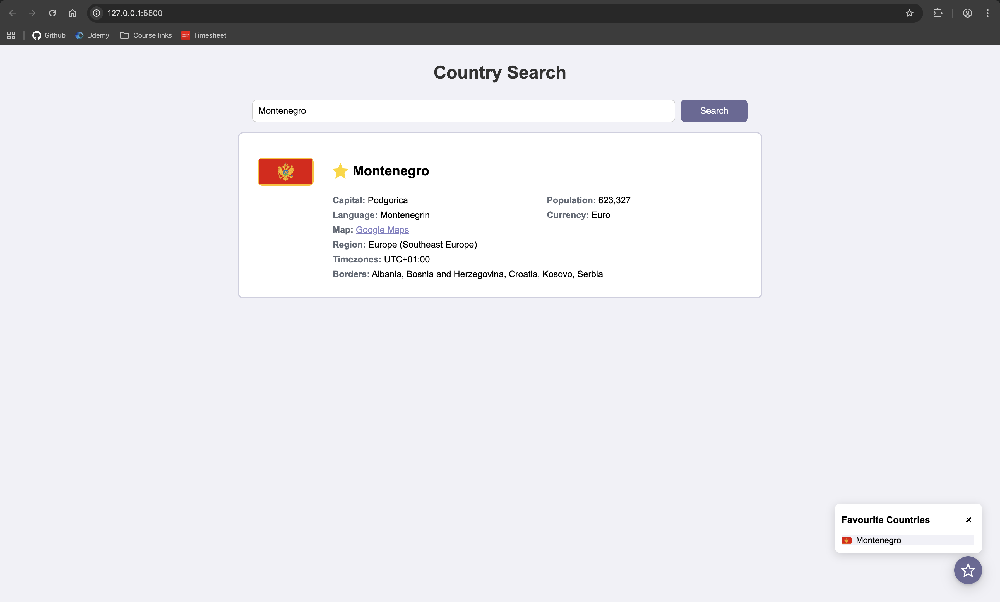
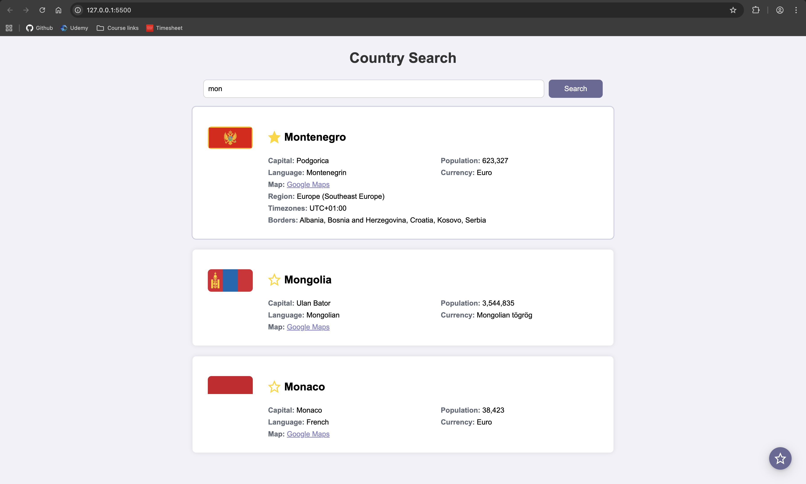

# Countries App

A simple web application for searching and exploring countries. This app allows users to search for countries by name, view country details, manage search history and mark favourite countries.

## Features

- **Country Search:** Search for countries by name using the search bar.
- **Country List:** View a list of countries matching your search query.
- **Search History:** Access previous search queries from a dropdown history.
- **Favourite Countries:** Mark countries as favourites and access them faster using the floating action button. If you click on a favourite country, you can see extra information.
- **Persistent Data:** Country data is cached in local storage for faster access. 

## Technologies Used

- **HTML5:** structure of the web app
- **CSS3:** styling and layout
- **JavaScript (ES6+):** application logic and dynamic UI

## Getting Started

1. Clone the repository:
```bash
git clone https://github.com/catalina-constantin/countries-app.git
```
2. Open `index.html` in your browser

## Project Structure

- `css/style.css` - Main stylesheet for the app.
- `js/main.js` - Main entry point, initialize UI and handles search logic.
- `js/api/countriesApi.js` - Fetches country data from the API.
- `js/components` - Contains UI components (SearchBar, CountryList, SearchHistory, FavouriteCountryFab)
- `index.html` - Main HTML file that loads the app.

## How It Works
- Enter a country name in the search bar and click "Search" or press Enter.
- Matching countries are displayed in the results area.

<div align="center">
  
</div>

- Previous searches are saved and accessible via the history dropdown.

<div align="center">
  
</div>

- Click on the star icon to add a country to your favourites list.
- Favourite countries can be easily accessed through the Favourite Countries FAB.

<div align="center">
  
</div>

- Clicking on a favourite country card will display additional information about that country.

<div align="center">
  
</div>

## License
This project is for educational purposes.
